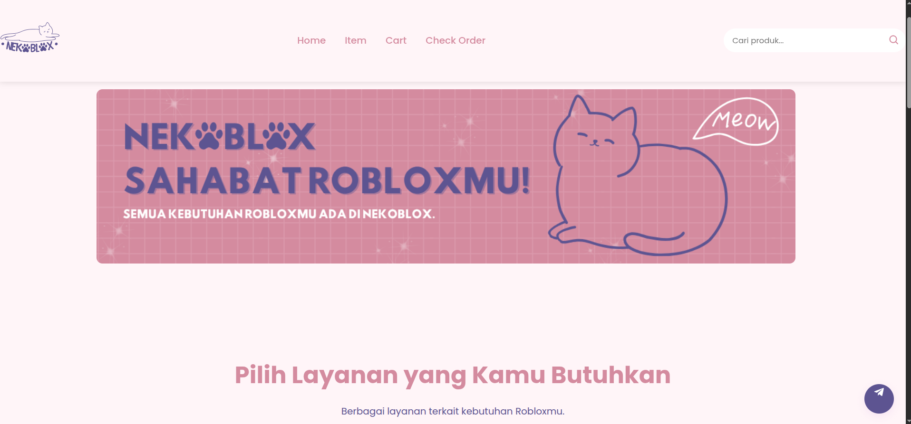

# Nekoblox - Sahabat Robloxmu!

[](https://developer.mozilla.org/en-US/docs/Web/HTML)
[](https://developer.mozilla.org/en-US/docs/Web/CSS)
[](https://developer.mozilla.org/en-US/docs/Web/JavaScript)
[](https://marketplace.visualstudio.com/items?itemName=ritwickdey.LiveServer)

## Deskripsi
Nekoblox adalah platform e-commerce sederhana untuk pembelian Robux dan Gamepass Roblox. Proyek ini dibangun sebagai tugas kelompok mata kuliah **Bahasa Pemrograman 2**. Fitur utama meliputi:
- Halaman utama (Home) dengan hero banner, layanan, statistik, best seller, dan FAQ.
- Halaman Item (Products) untuk memilih tipe Robux (Gamepass, Via Login, Gift) dan Gamepass dengan tab.
- Halaman Cart untuk menampilkan keranjang belanja dan metode pembayaran.
- Halaman Check Order untuk memeriksa status pesanan.
- Modal form untuk pemesanan dengan validasi input.
- Responsive design untuk mobile dan desktop.
- Penggunaan LocalStorage untuk menyimpan cart.

Proyek ini dibuat dengan **HTML5**, **CSS3**, dan **vanilla JavaScript**, tanpa framework eksternal.

## Anggota Kelompok
| Nama                  | NIM       |
|-----------------------|-----------|
| Ali Imannudin        | I.2410036 |
| Arinda Setyo Rini    | I.2410187 |
| Dimas Rizky Aliandy  | I.2310326 |

## Tech Stack
- **Frontend**: HTML5, CSS3 (Poppins font, Boxicons), JavaScript (ES6+).
- **Tools**: VS Code dengan extension [Live Server](https://marketplace.visualstudio.com/items?itemName=ritwickdey.LiveServer) untuk development.
- **Storage**: Browser LocalStorage untuk cart dan order.
- **Images**: Folder `images/` untuk aset visual (logo, banner, icons).

## Cara Install dan Menjalankan
1. **Clone/Download Proyek**:
   - Unduh seluruh folder proyek (termasuk `index.html`, `products.html`, `cart.html`, `check-order.html`, folder `css/`, `js/`, dan `images/`).

2. **Setup VS Code**:
   - Buka VS Code.
   - Install extension **Live Server** (cari di Extensions tab).

3. **Jalankan Proyek**:
   - Buka folder proyek di VS Code.
   - Right-click pada `index.html` > **Open with Live Server**.
   - Browser akan otomatis terbuka di `http://127.0.0.1:5500/index.html`.
   - Navigasi antar halaman via menu navbar.

4. **Development Notes**:
   - Edit file di VS Code, Live Server akan auto-reload browser.
   - Pastikan gambar di folder `images/` tersedia untuk tampilan optimal.
   - Test responsive: Resize browser atau gunakan DevTools (F12 > Toggle device toolbar).

## Struktur Folder
```
nekoblox/
├── index.html          # Halaman utama
├── products.html       # Halaman item/produk
├── cart.html           # Halaman keranjang
├── check-order.html    # Halaman cek order
├── css/
│   └── style.css       # Styles global (responsive)
├── js/
│   └── main.js         # Logic JS (modal, cart, tabs)
└── images/             # Aset gambar (logo, banner, icons)
```

## Fitur Utama
- **Navbar Fixed**: Responsif dengan hamburger menu untuk mobile.
- **Modal Order**: Form dinamis untuk gamepass dan Robux dengan validasi.
- **Cart System**: Tambah/hapus item, hitung total + admin fee.
- **Tabs Gamepass**: Switch antar game (Expedition, Fish It, Grow a Garden).
- **FAQ Accordion**: Expand/collapse pertanyaan.
- **Floating CS Button**: Link ke Telegram support.

## Screenshot
 


## Kontribusi
Silakan fork repo ini dan buat pull request untuk perbaikan. Pastikan kode sesuai standar (indentasi 2 spaces, komentar JS).

## Lisensi
Proyek ini bersifat edukasi dan open-source di bawah MIT License. Gunakan untuk belajar saja, jangan untuk produksi komersial tanpa izin.

**Terima kasih!** 🐱‍👤  
Dibuat pada Oktober 2025 untuk tugas Bahasa Pemrograman 2.